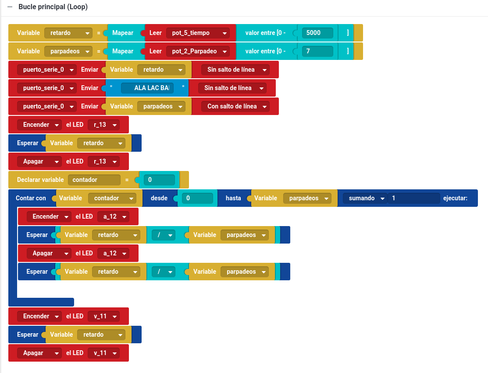
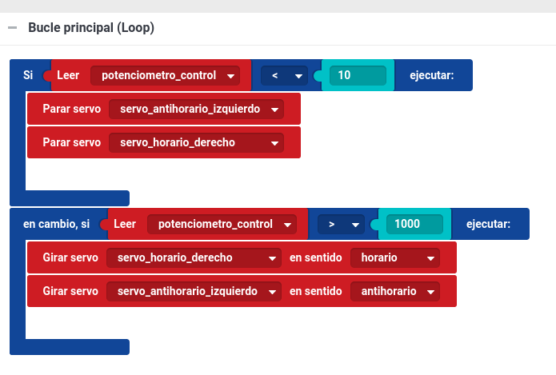

# Clases Primaria Tech

# Clases de robótica para primaria

Trabajamos con niño de 8 años, pero con experiencia previa en programación y de robótica (Lego)

## Introducción

Les presentamos algunos componentes (servos, sensores siguelíneas y leds) que identifican perféctamente y una placa de Arduino que reconoce incluso indica los tipos de entradas/salidas

Hablamos de diseño 3D y de programación

## Clase 1

Programación con bitbloq

Encuentran los bloques sin dificultad

Entienden los bloques de control (incluso los bucles)

Se muestran el concepto de variable, presentando los tipos y el ámbito (local/global)

### Proyectos:
* Semáforo sencillo
* Semáforo con intermitencias

[Proyecto semaforororororo amarillo](./proyectos/semaforororororo amarillo.json)

## Clase 2 y 3

Introducimos el concepto de entrada analógica: potenciómetros como reguladores

Problemas por no haber etiquetado bien las entradas/cables

Hacer cálculos mentales para ver la duración/retardo

### Proyectos
* Semáforo con duración regulada por potenciómetro
* Semáforo con parpadeos regulados por potenciómetro

[Proyecto semaforo prueba---inteligente](./proyectos/semaforo prueba---inteligente.json)

Vemos el problema de usar esperas

Presentamos el sensor siguelíneas (Infrarrojos)

### Proyectos

* Semáforo con pulsador

## Clase 4

Utilizamos sensores de proximidad Infrarrojos:
* Sensor digital
* Sensor analógico

¿Qué ocurre si movemos junto al borde de la mesa un sensor IR?

[Solución](./images/MoviendoIRRapido.mp4)

¿Se pueden ver la luz infrarroja de alguna manera? Prueba a verla a través de la cámara de tu móvil....

### Proyectos

* Detección del suelo
* Hucha

## Clase 5

Sensor analógico de proximidad infrarrojo :
* Calibración de colores

1ª versión del robot (sólo con componentes del kit)

## Clase 6

Objetivo: vamos a dibujar una paisaje con montañas, pero que no sea siempre igual. Para ellos usamores **números aleatorios**

Vamos a hacer un viaje por la tierra, y usaremos 2 leds: uno azul para representar el mar y otro verde para la tierra. En el visor de gráficos veremos la forma de nuestra montaña

[Proyecto montaña_prueba_1_-------------------------------------------------------------------------------------------------](./proyectos/montaña_prueba_1_-------------------------------------------------------------------------------------------------.json)

## Clase 7

Robot

Montamos un robot con materiales reciclados (cajas, clips y gomas elásticas)

* Controlamos el robot a distancia con el potenciometro:
  * <100 Hacia atrás
  * >900 Hacia adelante
  * En otro caso se para

¿Podemos añadir más opciones?

[video](./images/robot.mp4)

## Clase 8

Hacer un programa reutilizable con funciones

[Proyecto](./proyectos/FuNcIoNeS############################################################################.json) (FuNcIoNeS############################################################################)

Terminado el montaje del robot

## Clase 9

* Objetivo: Robot que no se cae de la mesa

¿Cómo funcionan los Sensores IR?

Ejemplo muy sencillo para ver los valores:

Resultado: El sensor da 1 cuando tiene suelo

Extra: ¿Cómo funcionan los Infrarrojos de un mando a distancia? ¿Qué envían? ¿Cómo no se mezclan la señal de los mandos?

## Clase 10

Aprendemos a definir y documentar proyectos:
Proyecto: Diseño de mando para robot

Para introducir el diseño 3D, usamos la web https://www.tinkercad.com

1er Diseño

https://www.tinkercad.com/things/1Udvn6yMVB0-mando-robot-v10

Se preparan fechas y estimaciones así como % de completación

## Programa para la versión 1.0 de Robot NoTeCaigas

[Proyecit Robot v1.0'gnghfbhfgjson](./proyectos/robot1.0.json)

## Próximo Reto: Siguelíneas

## Clase 11

[Kit de 24 sensores](http://tienda.bricogeek.com/kits-arduino/830-octopus-brick-kit-de-24-sensores-para-arduino.html)

Identificamos los distintos sensores

Empezamos clasificando sensores digitales y analógicas

Definimos proyecto "Termostato":
* Sensor de temperatura
* Sensor de presencia
* Motor para enfríar
* ¿Relé para calefacción?

## Clase 12 y Clase 13

Programando con Arduino:
* Funciones
* Variables
* Tipos de Variables: int, float y String
  * ¿Por qué hay diferentes tipos?
  * Valores máximos y mínimos
  * Tipos más detallados: byte, int, long
* Envio de datos al PC

##
